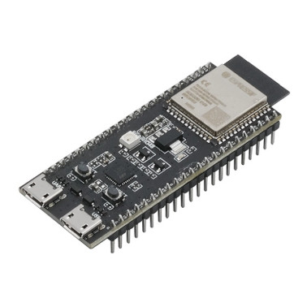
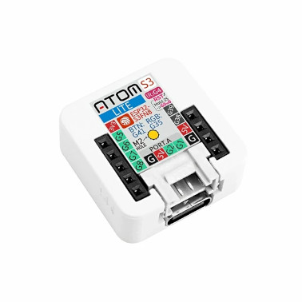
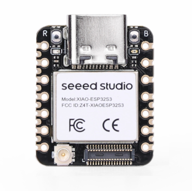
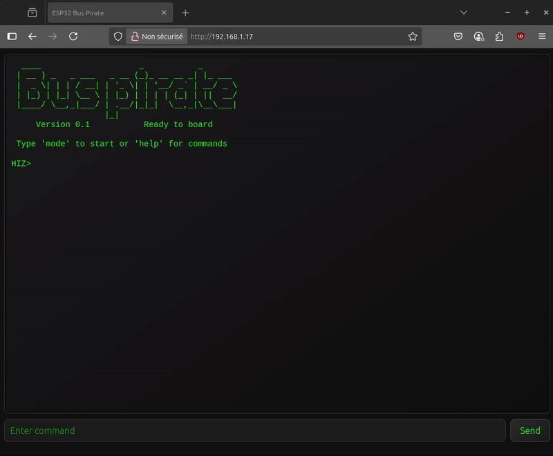

# ESP32 Bus Pirate

**ESP32 Bus Pirate** is an open-source firmware that turns your device into a multi-protocol hacker's tool, inspired by the [legendary Bus Pirate](https://buspirate.com/).

It supports sniffing, sending, scripting, and interacting with various digital protocols (I2C, UART, 1-Wire, SPI, etc.) via a serial terminal or web-based CLI.


## Features

- Interactive command-line interface (CLI) via **USB Serial or WiFi Web**.
- **Modes for:**
   - [HiZ](https://github.com/geo-tp/ESP32-Bus-Pirate/wiki/01-HiZ) (default)
   - [I2C](https://github.com/geo-tp/ESP32-Bus-Pirate/wiki/05-I2C) (scan, glitch, slave mode, dump, eeprom)
   - [SPI](https://github.com/geo-tp/ESP32-Bus-Pirate/wiki/06-SPI) (eeprom, flash, sdcard, slave mode)
   - [UART](https://github.com/geo-tp/ESP32-Bus-Pirate/wiki/03-UART) / [Half-Duplex UART](https://github.com/geo-tp/ESP32-Bus-Pirate/wiki/04-HDUART) (bridge, read, write)
   - [1WIRE](https://github.com/geo-tp/ESP32-Bus-Pirate/wiki/02-1WIRE) (ibutton, eeprom)
   - [2WIRE](https://github.com/geo-tp/ESP32-Bus-Pirate/wiki/07-2WIRE) (sniff, smartcard) / [3WIRE](https://github.com/geo-tp/ESP32-Bus-Pirate/wiki/08-3WIRE) (eeprom)
   - [DIO](https://github.com/geo-tp/ESP32-Bus-Pirate/wiki/09-DIO) (Digital I/O, read, pullup, set, pwm)
   - [Infrared](https://github.com/geo-tp/ESP32-Bus-Pirate/wiki/11-INFRARED) (device-b-gone, universal remote)
   - [USB](https://github.com/geo-tp/ESP32-Bus-Pirate/wiki/12-USB) (HID, mouse, keyboard, gamepad, storage)
   - [Bluetooth](https://github.com/geo-tp/ESP32-Bus-Pirate/wiki/13-BLUETOOTH) (BLE HID, scan, spoofing, sniffing)
   - [Wi-Fi](https://github.com/geo-tp/ESP32-Bus-Pirate/wiki/14-WIFI) / [Ethernet](https://github.com/geo-tp/ESP32-Bus-Pirate/wiki/18-ETHERNET) (sniff, deauth, nmap, netcat)
   - [JTAG](https://github.com/geo-tp/ESP32-Bus-Pirate/wiki/15-JTAG) (scan pinout, SWD)
   - [LED](https://github.com/geo-tp/ESP32-Bus-Pirate/wiki/10-LED) (animations, set LEDs)
   - [I2S](https://github.com/geo-tp/ESP32-Bus-Pirate/wiki/16-I2S) (test speakers, mic, play sound)
   - [CAN](https://github.com/geo-tp/ESP32-Bus-Pirate/wiki/17-CAN) (sniff, send and receive frames)
   - [SUBGHZ](https://github.com/geo-tp/ESP32-Bus-Pirate/wiki/19-SUBGHZ) (sniff, scan)

- **Protocol sniffers** for I2C, Wi-Fi, Bluetooth, 1Wire, 2wire, CAN, SubGhz.
- Baudrate **auto-detection**, AT commands and various tools for UART.
- Registers manipulation, **eeprom dump tools**, identify devices for I2C.
- Read all sort of **EEPROM, Flash** and various others tools for SPI.
- Scripting using **Bus Pirate-style bytecode** instructions.
- Device-B-Gone command with more than **80 supported INFRARED protocols**.
- Direct I/O management, **PWM, servo**, pulse.
- Near than **50 addressable LEDs protocols** supported.
- **Ethernet and WiFi** are supported to access networks.
- Web interface with **live terminal**, or a classic **serial CLI**.

## Supported Devices

- **ESP32 S3 Dev Kit**



- **M5 Cardputer**


- **M5 Stick C Plus 2**


- **M5 Atom S3 Lite**



- **M5 Stamp S3**


- **LILYGO T-Embed**


- **LILYGO T-Embed CC1101**


- **Seeed Studio Xiao S3**




## Wiki

📚 Visit the **[Wiki](https://github.com/geo-tp/ESP32-Bus-Pirate/wiki)** for detailed documentation on every mode and command.

Includes:
- [Terminal mode](https://github.com/geo-tp/ESP32-Bus-Pirate/wiki/00-Terminal) - About serial and web terminal.
- [Mode overviews](https://github.com/geo-tp/ESP32-Bus-Pirate/wiki) - Browse supported modes.
- [Instruction syntax](https://github.com/geo-tp/ESP32-Bus-Pirate/wiki/99-Instructions) - Master the instructions.
- [Serial setup](https://github.com/geo-tp/ESP32-Bus-Pirate/wiki/99-Serial) - Serial access via USB.
- [Python scripting examples](https://github.com/geo-tp/ESP32-Bus-Pirate/wiki/99-Python) - Automate tasks using Python.


The wiki is the best place to learn how everything works.

## Getting Started

1. 🔧 Flash the firmware  
   - Download the latest release from the [Releases](https://github.com/geo-tp/ESP32-Bus-Pirate/releases) page, and flash it using your favorite tool (`esptool.py`, `PlatformIO`, etc.).
   - You can also burn it on [M5Burner](https://docs.m5stack.com/en/download), in the M5stick, AtomS3, M5StampS3 or Cardputer category.

2. 🔌 Connect via Serial or Web
   - Serial: any terminal app (see [Connect via Serial](https://github.com/geo-tp/ESP32-Bus-Pirate/wiki/99-Serial))
   - Web: configure Wi-Fi and access the CLI via browser (see [Wi-Fi Connection](https://github.com/geo-tp/ESP32-Bus-Pirate/wiki/00-Terminal))

3. 🧪 Use commands like:
   ```bash
   mode
   help
   scan
   sniff
   ...
    ```
   See detailed explanations about [Terminal Commands](https://github.com/geo-tp/ESP32-Bus-Pirate/wiki) and how each one works.

## Getting Started (for noobs)

Don’t know how to flash firmware? Read this:

1. **📥 Install [M5Burner](https://docs.m5stack.com/en/download),** Download M5Burner for your system (Windows/macOS/Linux). Open it after installation.

2. **📂 Select the Firmware:** In M5Burner, go to the M5Stick, Cardputer, M5StampS3, or AtomS3 category. Find ESP32-Bus-Pirate in the list.

3. **⚡ Click Flash:** Connect your device via USB. Hit the Flash button. Wait a few seconds… and done.


That’s it, no command line, no complicated tools, just 3 clicks and you’re ready to go. You can now [connect via Serial or WiFi](https://github.com/geo-tp/ESP32-Bus-Pirate/wiki/00-Terminal).
   
## ESP32 Bus Pirate on M5 Devices


## ESP32 Bus Pirate on T-Embed


## Web & Serial Interfaces

The ESP32 Bus Pirate firmware provides two command-line interface (CLI) modes:

| Interface         | Advantages                                                                 | Ideal for...                          |
|------------------|-----------------------------------------------------------------------------|----------------------------------------|
| **Web Interface** | - Accessible from any browser<br>- Works over Wi-Fi<br>- No cables needed | Quick tests, demos, headless setups   |
| **Serial Interface** | - Faster performance<br>- Instant responsiveness<br>- Handles large data smoothly | Intensive sessions, frequent interactions |


Both interfaces share the same command structure and can be used interchangeably ([more details](https://github.com/geo-tp/ESP32-Bus-Pirate/wiki/00-Terminal)).


## Using the ESP32 Bus Pirate to speak UART over WiFi


## Contribute
See [How To Contribute](https://github.com/geo-tp/ESP32-Bus-Pirate/wiki/99-Contribute) section, which outlines a simple way to add a new command to any mode.

## Warning
> ⚠️ **Voltage Warning**: Devices should only operate at **3.3V** or **5V**.  
> Do **not** connect peripherals using other voltage levels — doing so may **damage your ESP32**.
